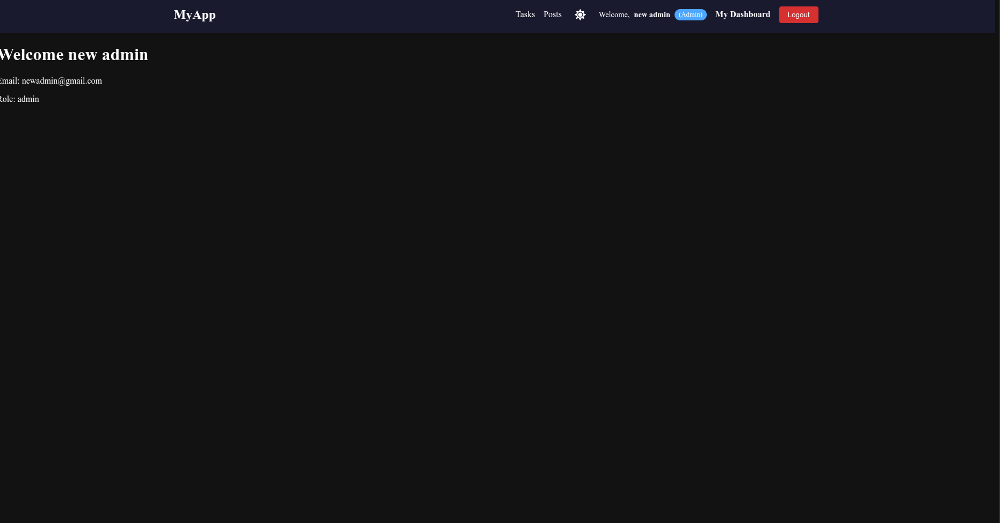
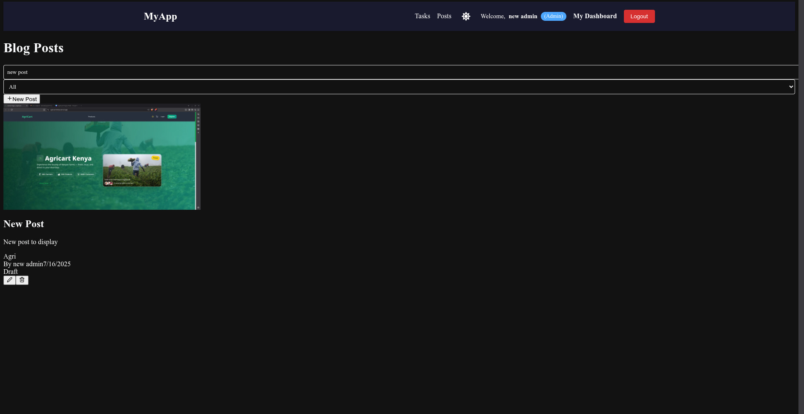
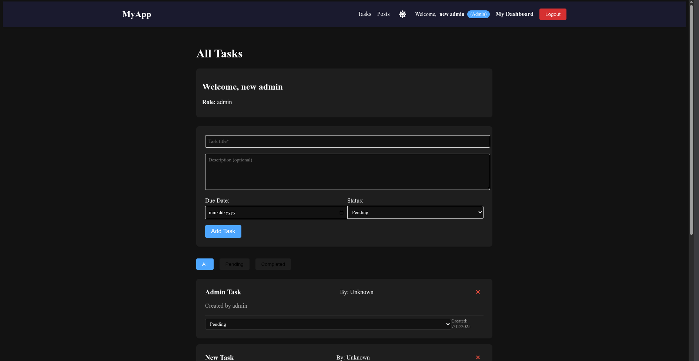

# MERN Blog — Week 4 Integration Assignment

This is a simple full-stack blog application built with the **MERN stack**:
- **MongoDB**
- **Express.js**
- **React.js**
- **Node.js**

It demonstrates CRUD operations, RESTful APIs, authentication, and dynamic UI with React Hooks and Context.

---

## 🔑 Features
✅ User registration & login
✅ Role-based dashboards (Admin, Manager, Sales)
✅ Create, update, delete, filter, and search blog posts
✅ Upload featured images
✅ Fully responsive UI with Tailwind CSS
✅ Context API for auth & theme toggle
✅ Toast notifications for feedback
✅ Admin can create categories

## 📸 Screenshots





## 📁 **Project Structure**


## Project Structure

```
├── client/                 # React front-end
│   ├── public/             # Static files
│   ├── src/                # React source code
│   │   ├── components/     # Reusable components
│   │   ├── pages/          # Page components
│   │   ├── hooks/          # Custom React hooks
│   │   ├── services/       # API services
│   │   ├── context/        # React context providers
│   │   └── App.jsx         # Main application component
│   └── package.json        # Client dependencies
├── server/                 # Express.js back-end
│   ├── config/             # Configuration files
│   ├── controllers/        # Route controllers
│   ├── models/             # Mongoose models
│   ├── routes/             # API routes
│   ├── middleware/         # Custom middleware
│   ├── utils/              # Utility functions
│   ├── server.js           # Main server file
│   └── package.json        # Server dependencies
└── README.md               # Project documentation
```


---

## ⚙️ **Setup Instructions**

### 1️⃣ **Clone the repository**

```bash
git clone https://github.com/PLP-MERN-Stack-Development/week-4-mern-integration-assignment-Anthonyyos22.git
cd week-4-mern-integration-assignment-Anthonyyos22
```

### 2️⃣ **Install dependencies**

#### Server:
```bash
cd server
npm install
```

#### Client:
```bash
cd ../client
npm install
```

 
### 3️⃣ Set up environment variables
Create a .env file in the server/ folder: Use .env.example


### 4️⃣ Run the app
Server:

```bash
cd server
npm run dev
```

Client:

```bash
cd ../client
npm run dev
```
```
Visit: http://localhost:5173 to view the React app.
```


